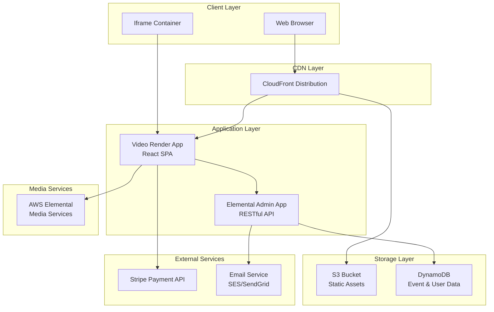

# Design Document

## Overview

The AWS Elemental Media Replacement System is a comprehensive event booking and video streaming platform that replaces Vimeo with AWS Elemental media services. The system consists of two main applications: an administrative backend for event management and a user-facing frontend for video consumption, registration, and payment processing. The architecture maintains iframe compatibility while providing flexible authentication flows and payment integration.

## Architecture

### High-Level Architecture



### Component Architecture

The system follows a microservices-inspired architecture with clear separation of concerns:

1. **Frontend Layer**: React-based Video Render App served via CloudFront
2. **Backend Layer**: RESTful API for administrative functions and data management
3. **Data Layer**: DynamoDB for persistent storage
4. **Media Layer**: AWS Elemental for video streaming
5. **Integration Layer**: External services for payment and email

## Components and Interfaces

### 1. Elemental Admin App (Backend API)

**Technology Stack**: Node.js/Python with Express/FastAPI framework
**Responsibilities**:
- Event creation and management
- Registration form configuration
- User analytics and reporting
- API endpoints for Video Render App
- Integration with AWS services

**Key Endpoints**:
```
GET /api/events/{eventId} - Retrieve event configuration
POST /api/events - Create new event
PUT /api/events/{eventId} - Update event settings
GET /api/events/{eventId}/registrations - Get registration data
POST /api/registrations - Process user registration
POST /api/auth/login - Authenticate user credentials
GET /api/analytics/{eventId} - Retrieve event analytics
```

### 2. Video Render App (Frontend)

**Technology Stack**: React.js with TypeScript
**Responsibilities**:
- Video playback using AWS Elemental
- Dynamic registration form rendering
- User authentication flows
- Payment processing integration
- Session management

**Key Components**:
- `VideoPlayer`: AWS Elemental integration component
- `RegistrationForm`: Dynamic form based on admin configuration
- `AuthenticationFlow`: Handles login/registration logic
- `PaymentProcessor`: Stripe integration component
- `SessionManager`: Cookie and state management

### 3. Database Schema (DynamoDB)

**Events Table**:
```json
{
  "eventId": "string (PK)",
  "title": "string",
  "description": "string",
  "authType": "none|email|password|payment",
  "videoUrl": "string",
  "registrationConfig": {
    "fields": ["email", "name", "phone"],
    "required": ["email"]
  },
  "paymentConfig": {
    "price": "number",
    "currency": "string"
  },
  "createdAt": "timestamp",
  "updatedAt": "timestamp"
}
```

**Registrations Table**:
```json
{
  "registrationId": "string (PK)",
  "eventId": "string (GSI)",
  "email": "string",
  "userData": "object",
  "authToken": "string",
  "paymentStatus": "pending|completed|failed",
  "accessUrl": "string",
  "createdAt": "timestamp"
}
```

**Sessions Table**:
```json
{
  "sessionId": "string (PK)",
  "userId": "string",
  "eventId": "string",
  "expiresAt": "timestamp",
  "createdAt": "timestamp"
}
```

## Data Models

### Event Configuration Model
```typescript
interface EventConfig {
  eventId: string;
  title: string;
  description: string;
  authType: 'none' | 'email' | 'password' | 'payment';
  videoConfig: {
    elementalUrl: string;
    manifestUrl: string;
    thumbnailUrl?: string;
  };
  registrationConfig: {
    fields: RegistrationField[];
    customization: FormCustomization;
  };
  paymentConfig?: {
    price: number;
    currency: string;
    stripeProductId: string;
  };
}
```

### User Registration Model
```typescript
interface UserRegistration {
  registrationId: string;
  eventId: string;
  email: string;
  userData: Record<string, any>;
  authToken?: string;
  paymentStatus: 'pending' | 'completed' | 'failed';
  accessUrl?: string;
  createdAt: Date;
}
```

### Authentication Flow Model
```typescript
interface AuthFlow {
  flowType: 'none' | 'email' | 'password' | 'payment';
  currentStep: string;
  sessionData: Record<string, any>;
  redirectUrl?: string;
}
```

## Error Handling

### Client-Side Error Handling
- **Network Errors**: Retry mechanism with exponential backoff
- **Authentication Errors**: Clear error messages and redirect to appropriate flow
- **Payment Errors**: Integration with Stripe error handling
- **Video Playback Errors**: Fallback mechanisms and user notifications

### Server-Side Error Handling
- **API Errors**: Standardized error response format
- **Database Errors**: Connection pooling and retry logic
- **External Service Errors**: Circuit breaker pattern for Stripe/Email services
- **Validation Errors**: Comprehensive input validation and sanitization

### Error Response Format
```json
{
  "error": {
    "code": "string",
    "message": "string",
    "details": "object",
    "timestamp": "ISO8601"
  }
}
```

## Testing Strategy

### Unit Testing
- **Frontend**: Jest + React Testing Library for component testing
- **Backend**: Jest/Pytest for API endpoint testing
- **Database**: Mock DynamoDB for data layer testing
- **Integration**: Test external service integrations with mocks

### Integration Testing
- **API Integration**: End-to-end API flow testing
- **Payment Flow**: Stripe test environment integration
- **Authentication**: Complete auth flow validation
- **Video Playback**: AWS Elemental integration testing

### Performance Testing
- **Load Testing**: Simulate concurrent user access
- **Video Streaming**: Test various bitrates and resolutions
- **Database Performance**: Query optimization and indexing validation
- **CDN Performance**: CloudFront cache hit ratio optimization

### Security Testing
- **Authentication**: Session management and token validation
- **Payment Security**: PCI compliance verification
- **Data Protection**: Input sanitization and SQL injection prevention
- **CORS Configuration**: Cross-origin request validation

## Infrastructure and Deployment

### AWS Services Integration
- **CloudFront**: CDN for static asset delivery and caching
- **S3**: Static website hosting for React application
- **DynamoDB**: NoSQL database with auto-scaling
- **Elemental MediaLive/MediaPackage**: Video streaming infrastructure
- **SES**: Email delivery service
- **Lambda**: Serverless functions for background processing
- **API Gateway**: RESTful API management and throttling

### Security Considerations
- **HTTPS Enforcement**: All communications over TLS
- **API Authentication**: JWT tokens for API access
- **CORS Configuration**: Restricted cross-origin access
- **Input Validation**: Server-side validation for all inputs
- **Rate Limiting**: API throttling to prevent abuse
- **Data Encryption**: Encryption at rest and in transit

### Monitoring and Analytics
- **CloudWatch**: Application and infrastructure monitoring
- **Custom Metrics**: User engagement and video analytics
- **Error Tracking**: Centralized error logging and alerting
- **Performance Monitoring**: Response time and throughput tracking